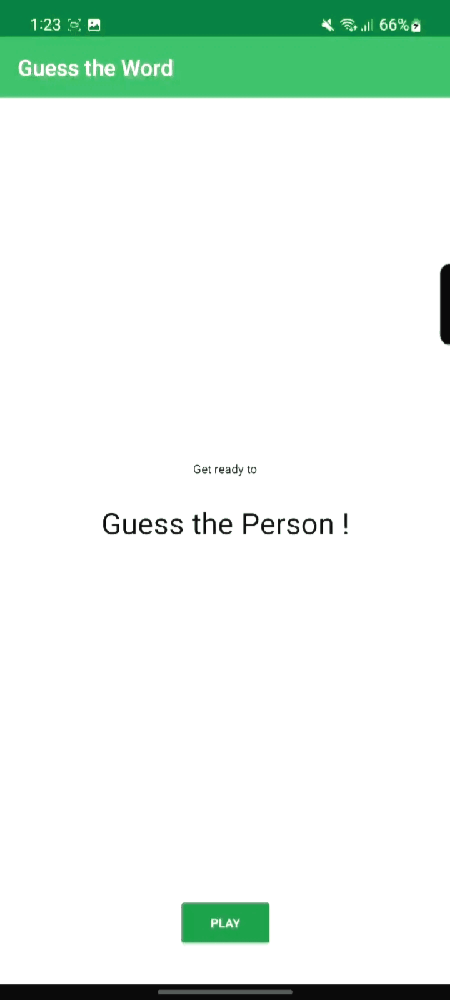

<h2 align="center">
  🤔 Guess the Word - An Android App to learn App Architecture (UI Layer) 🤔 
  <a href="https://learn.udacity.com/courses/ud9012/lessons/96180e5f-7158-4995-b52e-f404c098cb0d/concepts/c92dca9a-c991-45dc-8011-83faa6a5111b" target="_blank">App Architecture | UI Layer </a>
  <h3>Game Rule </h3>
  
<h5>
  This game is modified from Guessing the 'Word' to Guessing the 'Person'(specially my friends) 
  Each time the game will randomly show a name of my friend (which we call 'TargetWord')  
  One user will guess the TargetWord. Other user will mimic the facial expression / famous dialogue of the person written in TargetWord</h5> 

   
</h2>
 
 

  

 

You can fork this repo to modify and make changes of your own. Please Feel Free to send pull request with your updates [akifislam](https://github.com/akifislam). Thanks!

## Built With

This project was built using these technologies.

- Kotlin
- XML
- Android Studio
- Github Copilot

<h2 align="center">
Thanks | Made with ❤️ by Akif
</h2>

